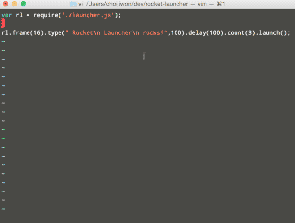

# rocket-launcher.js
 <br/>
launch your meaningful Node.js app with this ROCKET-LAUNCHER! <br/>
rocket-launcher will launch a huge ASCII rocket. <br/>
and, can even crash or explode the rocket! (maybe later) <br/>
[](https://nodei.co/npm/rocket-launcher/)

# NEW!
- mathod chaining with `delay(millisecond)` method
- use millisecond unit for methods
- it doesn't print if it's same previous screen buffer
- set fps(frames per second) with `frame(default=16)` method

# installation
`npm install rocket-launcher`

# usage
```js
var rl = require('rocket-launcher');

//method chaining
//set fps 16, make and show figlet text for 1000ms,count down 3, launch a rocket
rl.frame(16).type(" Rocket\n Launcher\n rocks!",1000).delay(1000).count(3).launch();

//print figlet text
rl.type("Rocket!", 1000);

//count down and show "FIRE"
rl.count(3);

//fire a rocket
rl.launch();
```
and watch the rocket.

# licence
`THE BEER-WARE LICENSE (Revision 42)`
